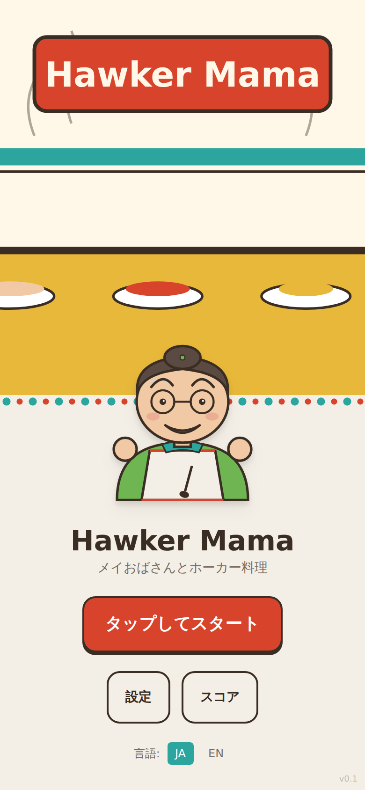
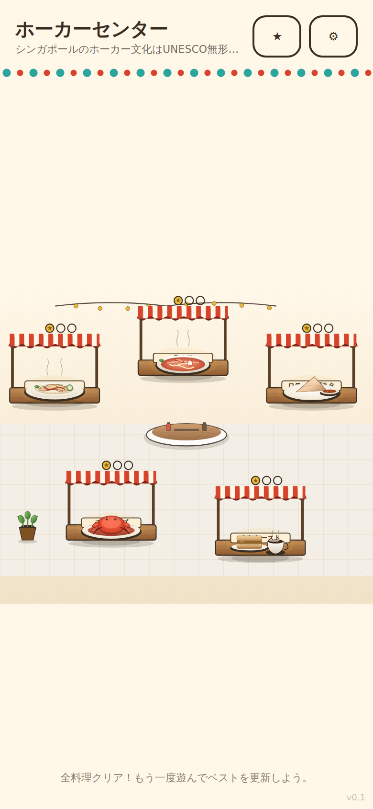
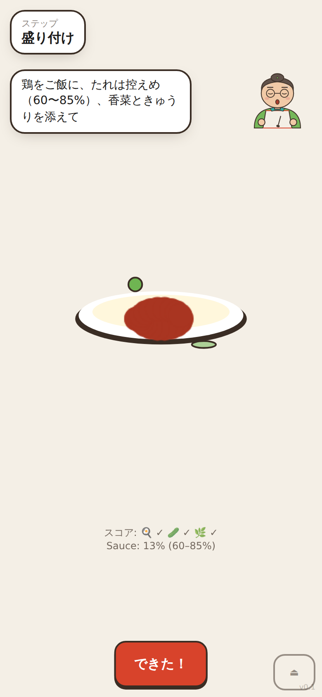
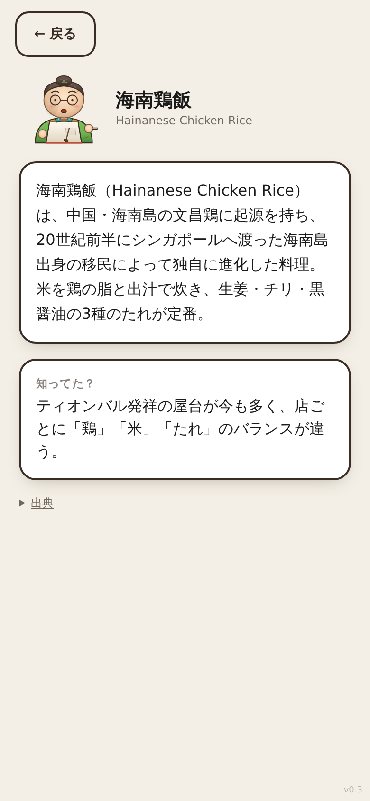

# Hawker Mama

Mobile-first browser cooking game teaching Singaporean cuisine to a
Japanese audience. Inspired by *Cooking Mama*; built with Vite + React +
TypeScript + Tailwind, custom Canvas/SVG rendering, WebAudio, and a
client-side animalese voice synth.

| Title | Hawker map | Cooking | Culture card |
|:---:|:---:|:---:|:---:|
|  |  |  |  |

> Full end-to-end screenshot walkthrough: [`handover/README.md#screenshots`](./handover/README.md#screenshots--full-end-to-end). Re-capture with `npm run capture`.

## Art

All art is **layered SVG** with gradients, patterns and subtle filters —
no third-party assets. Each ingredient (chicken slices, rice grains, sambal
drizzle, cucumber-with-seeds, kaya stack with kopi cup, cast-iron wok with
patina rings, brushed-steel pot, etc.) is built from 5–10 illustration
layers, on a `#3A2D24` warm-brown outline with `#F4EFE6` marble background
per the brief's §8 palette. See [`src/art/DishIcons.tsx`](./src/art/DishIcons.tsx)
for the reusable primitive library and [`src/art/AuntieMay.tsx`](./src/art/AuntieMay.tsx)
for the character.

- **Live preview:** https://bchuazw.github.io/cooking_game/ (after first
  successful workflow run; see `DEPLOY.md`)
- **Build decisions and substitutions:** [`DECISIONS.md`](./DECISIONS.md)
- **Handover (what's live, what's stubbed, walkthrough):** [`handover/README.md`](./handover/README.md)
- **Per-dish cultural sources:** [`content/culture-cards/`](./content/culture-cards)

## Quick start

```bash
npm install
npm run dev          # http://localhost:5173
npm run build        # produces dist/ (initial JS ~55 KB gz, dish bundles ≤ 24 KB gz)
npm run test:smoke   # headless Chromium smoke test (5 dishes)
npm run capture      # regenerate handover/screenshots/ end-to-end
```

## Project layout

See `DECISIONS.md` § "Engine substitution decisions" for why the ship stack
differs from the brief's nominal stack (bundle-budget driven; Phaser, Howler,
i18next, Dexie, Rive replaced with lighter, contract-equivalent modules).

```
src/
  App.tsx             # screen routing
  main.tsx            # entry
  state/store.ts      # Zustand persisted state
  i18n/               # JA-first i18n
  audio/              # animalese + sfx + music manifest loader
  art/
    AuntieMay.tsx     # procedural SVG character (Rive shim)
    DishIcons.tsx     # rich SVG primitives + reusable Defs
  game/
    engine/           # gestures, scoring, HUD, dish runner
    dishes/           # one folder per dish; each lazy-loaded
  ui/                 # React menu screens
content/culture-cards/<dish>/
  card.{ja,en}.md
  sources.md          # cited primary sources per brief §11
public/
  audio/music/        # manifest + ElevenLabs prompt seeds
  icons/              # PWA icons
handover/
  README.md           # screenshot walkthrough, what's live vs stubbed
  screenshots/        # 16 PNGs, regenerable via `npm run capture`
  walkthrough.md      # script for screen-recording a demo
  qr.png              # phone-test QR (regenerable via scripts/gen-qr.sh)
tests/
  smoke.mjs           # Playwright step-transition smoke test
  capture.mjs         # Playwright end-to-end screenshot capture
DECISIONS.md          # every non-trivial decision + rationale
SECRETS.md            # env-var inventory
DEPLOY.md             # GitHub Pages workflow notes
```

## License

Code: MIT (or whatever the operator chooses; LICENSE file not added so the
operator can pick deliberately). Per-dish cultural sources retain their own
attributions — see each `sources.md`.
